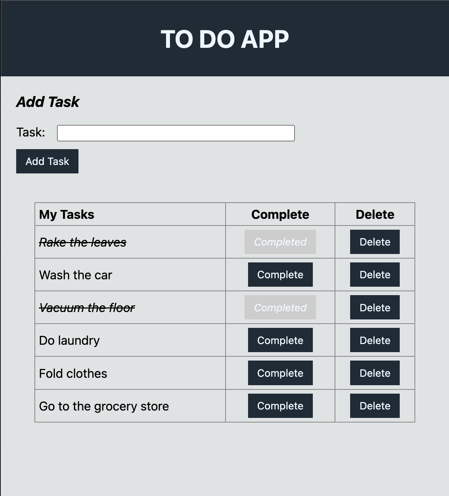
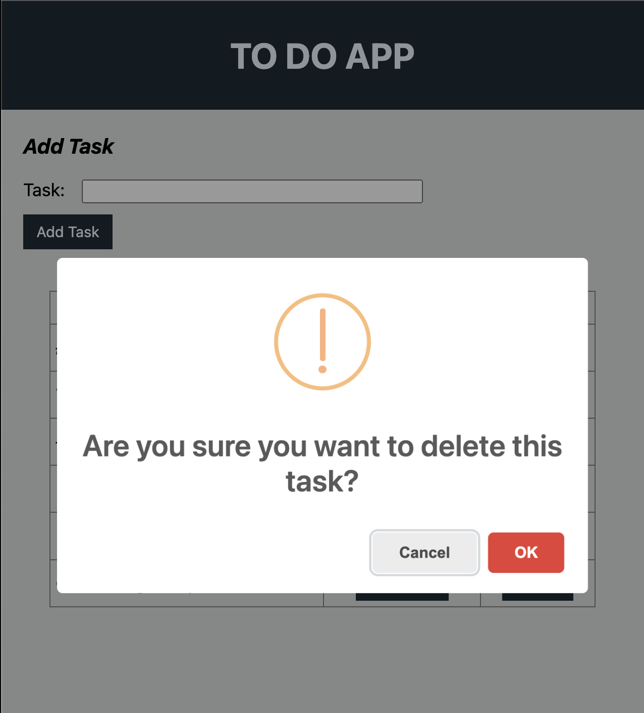

# Full Stack To-Do Application

## Description

_Duration: 2 Week Sprint_

This project is a to-do list application that allows a user to submit tasks to create a custom list. After adding each task, the user has the option to complete or delete each task. Because the user-created list is stored on a database, the user can close the application and return to their list when revisiting the application at a later time. The user is given visual feedback after choosing to complete the task. Upon deleting, the user is asked to confirm their choice, as to prevent accidental deletion.

### Prerequisite

Required software:

- [Node.js](https://nodejs.org/en/)
- [Postgres](https://www.postgresql.org/download/)
- [Postico](https://eggerapps.at/postico/)

## Installation

1. Create a database named `weekend-to-do-app`,
2. The queries in the `database.sql` file are set up to create all the necessary tables and populate the needed data to allow the application to run correctly. The project is built on [Postgres](https://www.postgresql.org/download/), so you will need to make sure to have that installed. Using Postico is recommended to run those queries. 
3. Open up your editor of choice and run an `npm install`
4. Run `npm run server` in your terminal
5. Open up an additional tab in your terminal and run `npm run client`
6. The `npm run client` command will open up a new browser tab for you

## Usage

1. After opening the app, the user would input their task in the input field, repeating as necessary to create their list.
2. Each task is displayed on the page to the user and is stored in the database so that the user can close the app and return to the saved list.
3. After each task is added, the user has the option to show each task "complete" by clicking on the "Complete" button next to the task.
4. Upon clicking "Complete", the user is given visual feedback by seeing the task crossed off and the button label showing "Completed". The database is also updated with this information.
5. The user can also remove a task from the list by clicking the "Delete" button next to the associated task. 
6. Upon clicking delete, the user will see a warning alert asking the user to confirm this option. If confirmed, the alert then states that the task has been deleted. The databse is also updated with this information. Otherwise, the task remains on the list.

## Built With

This app is built with HTML, CSS, Javascript, React, SweetAlert, PostgreSQL, and MaterialUI.

## Acknowledgement
Special thanks to [Prime Digital Academy](www.primeacademy.io) for providing me with the challenge and the resources that made this app a reality!

## Support
If you have suggestions or issues, please email me at [jeffvarughese@gmail.com](www.google.com)
